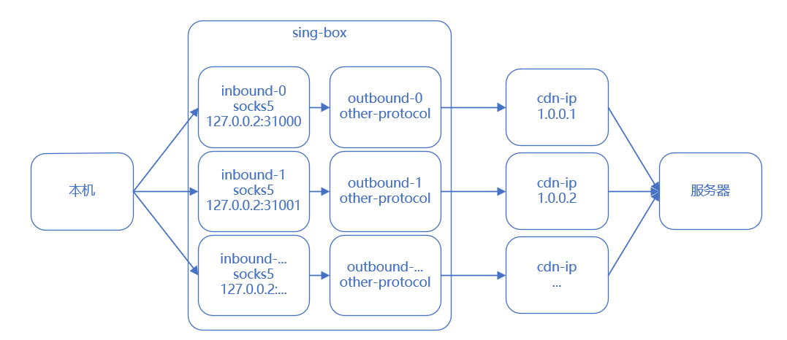

# cdn-ip-tester

查找适合自己当前网络环境的优选 CDN Anycast IP


## 使用申明

本项目侧重于研究任播技术中丢包率与网速的相互关系，仅供学习使用

禁止使用范围准则如下

a) 相关机构提示网页有威胁的，有非法信息提示的网站。

b)医院类型网站（流产，皮肤病，性病等医院），未获得卫生部资质的网站。

c)网站主体内容含有色情（视频交友，一夜情交友）、违法（办假证，贩卖仿真枪）、封建迷信、游戏私服、游戏外挂、网赚、两性、美女贴图和动漫贴图（尺度过大）、赌博（含贩卖赌博工具。）、博彩等内容。

d)网站存在恶意流氓广告（存在非法内容视频链接，非法网页内容链接）。

e)网站存在任何破坏或试图破坏网络安全的行为，以病毒、木马、恶意代码、钓鱼等方式，试图对网站、网络相关软硬件进行恶意扫描、非法侵入系统、非法获取数据等内容。

f)网站内容存在版权风险的网站（视频，小说，音乐等网站）。

g)网站含有药品销售、保健品销售，但未取得资质的，或严重夸大药效事实。

h)网站主要业务为向非法网站提供支付、交易平台、担保，代理外国金融理财（炒股，炒现货，炒黄金）等服务的网站。

i)网站中大量存在影响社会和谐稳定的内容的网站（涉嫌攻击国家，攻击领导人，攻击人民，言论煽动性质网站）。

j)网站内容含有国家相关法律法规不允许的其他内容。

k)网站内容含有VPN，网络代理等内容。

l) 通过技术手段或非技术手段干扰Cloudflare所有产品正常运营的网站。

m)网站内容为发布虚假不实消息行为，或侵害了他人的合法权益行为的网站。

n) 获取网站内容需要通过登录等方式，无法直接查看造成内容无法审核的网站。

o) 提供影视、软件和应用等下载服务的网站。

## 项目说明

本项目依托 [sing-box](https://github.com/SagerNet/sing-box)，用于测试本机经过 cdn 后到达服务器的整体延迟

与 better-cloudflare-ip 的不同：

better-cloudflare-ip 测试的是 **本机->cf** 的延迟
cdn-ip-tester 测试的是 **本机->cf->服务器** 的延迟

需要将 sing-box 的可执行文件放到当前目录下

## 原理

根据提供的 cdn 网段，自动生成 sing-box 的配置文件，形成多个 socks5 的代理，随后自动使用 socks5 代理访问 `http://{domain}{path}` 并将返回结果与 `{body}` 进行比较，同时计算总时间记为 rtt



## 配置文件

### sing-box-template.json

sing-box 的模板，cdn-ip-tester 会自动以该文件为模板，向 `inbounds`，`outbounds` 与 `rules` 中添加配置后生成 `sing-box-test-config.json`

### outbound-template.json

sing-box outbound 的模板， cdn-ip-tester 会自动为其添加 `tag` 和 `server` 后合并进 sing-box template，`outbound-template-template.json` 为 trojan+ws+0rtt 的配置样例

### ip-v4.txt

CDN 所有的 ip 网段，仓库中的 ip 为 cloudflare 的 ip 网段

### ip-tester.toml

cdn-ip-tester 的配置文件

```toml
port_base = 31000 # 本机监听的最小端口值
max_connection_count = 50 # 同时测试的最大连接数
domain = "127.0.0.1" # 远程 url
path = "/" # 远程 path
listen_ip = "127.0.0.2" # 绑定的本机 ip
max_rtt = 800 # 最大延迟，超时后的结果会被自动丢弃
body = "f**k you" # http://{domain}{path} 的返回结果
```

## 缓存文件

### rtt_result.txt

其中存储了延迟测试的结果，如果该文件存在每次运行时都会自动加载其中的数据

### rtt_result_cache.toml

其中存储了延迟测试的进度，如果该文件存在每次运行时都会自动加载其中的数据

## 引用声明

本项目参考了 https://github.com/badafans/better-cloudflare-ip

对于 Cloudflare ASN https://bgp.he.net/AS13335 ，Cloudflare IP Ranges 来自 https://www.cloudflare.com/zh-cn/ips/